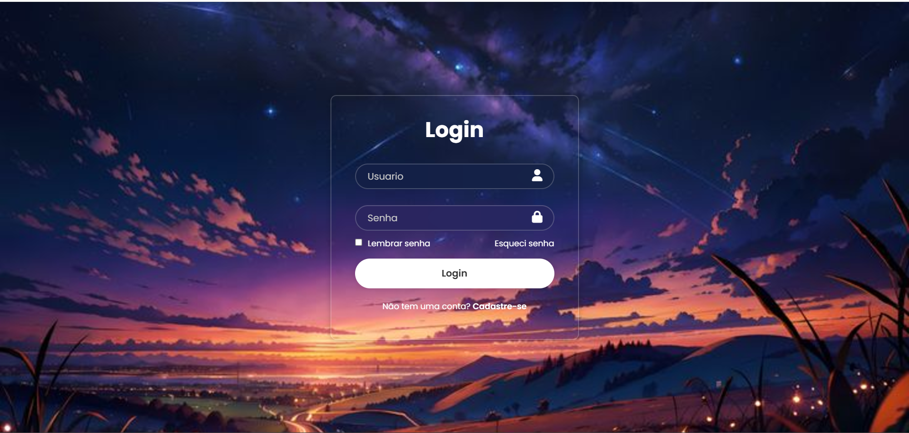

## Projeto de Login

Criando um formulário de acesso.

[]

Um projeto desenvolvido, junto no YouTube do canal ProCod.

O objetivo do projeto é criar um formulário simples apenas com HTML e CSS e com uma parte visual estilosa.

## Aprendizagem

Bem, o projeto foi desenvolvido com um mentor desenvolvendo, porém achei bem interessante e consegui aprender novas possibilidades e interações ao desenvolver. Como foi um dos primeiros projetos, criando um formulário com estilo, posso atribuir como próximos desafios criar sozinho próximos e até atribuir em mais projetos.  

## Linguagens utilizadas
- HTML & CSS ...
